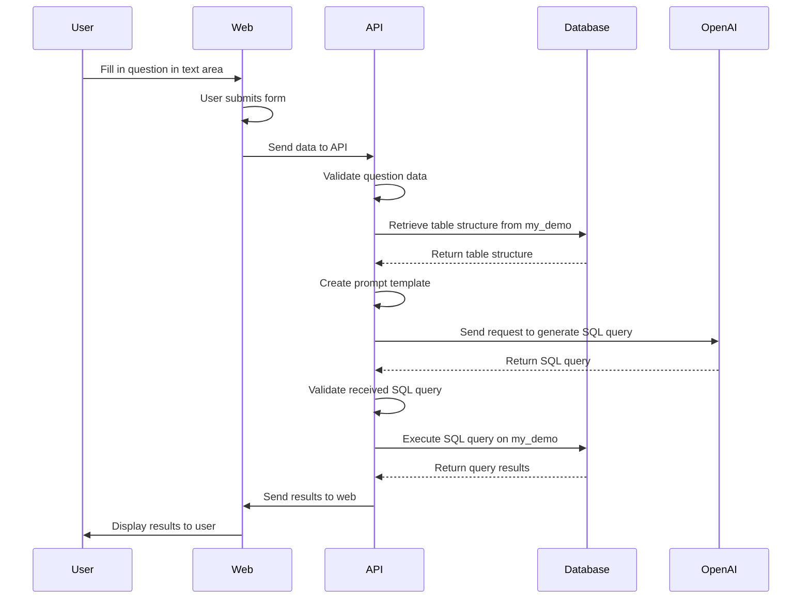

# Worshop :: Vibe coding

## 1. Feature flow
1. ผู้ใช้งานทำการกรอกข้อมูลคำถามผ่านหน้า web แสดงเป็น text area
2. เมื่อทำการ submit form แล้ว จะส่งข้อมูลไปยัง API
3. ระบบ API มีการทำงานดังนี้
   3.1 ทำการ validate ข้อมูลคำถาม
   3.2 ทำการดึงข้อมูลโครงสร้างของ table ทั้งหมดจาก database ชื่อว่า my_demo
   3.3 ทำการสร้าง prompt template และส่ง request ไปยัง OpenAI API เพื่อำการสร้าง SQL query
   3.4 เมื่อได้รับข้อมูล SQL query มาแล้ว ให้ทำการตรวจสอบว่าถูกต้องหรือไม่
   3.5 ทำการ execute SQL query ไปยัง database ชื่อว่า my_demo
   3.6 ส่งผลการทำงานกลับไปยัง web
4. ฝั่ง web รับข้อมูลมาแล้ว ทำการแสดงผล

## 2. Sequence diagram ของการทำงาน
* https://excalidraw.com/



## 3. Architecture and technologies stack
* Frontend
  * Web app
  * ReactJS
  * Call Backend API with Axios library
  * UI Testing with Playwright
* Backend
  * REST API
  * NodeJS
  * ExpressJS library to develop REST API
  * Connect to MySQL server with mysql2 library
  * API Testing with jest and supertest
* Database with MySQL

## 4. UI design


## 5. API design
```
POST /question
{
    "input": "พนักงานมีทั้งหมดกี่คน"
}

Response code = 200
[
    {
        "row": 1,
        "data": {
            "id": 1,
            "name": "user 1"
        }
    }
]

Response code = 404
{
    "message": "Data not found in system"
}
```

Response code = 500
{
    "message": "System error"
}
```

## 6. Development for Frontend
* React + TypeScript with [Vite](https://vite.dev/)
```
$npm create vite@latest
$cd frontend
$npm install
$npm run dev
```

## 7. Testing


## 8. Deployment

